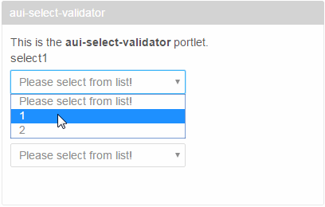

# validation of an aui:select tag

custom validators works for aui:input tags but not with aui:select.

Here you can find the [documentation](https://dev.liferay.com/develop/tutorials/-/knowledge_base/6-2/using-the-alloyui-validator-tag) of javascript validation of aui:input tag.
It does not mention aui:select validation, however, this code works in a way, but not perfeclty:


```
<aui:form action="<%=formRenderUrl.toString()%>" name="fm1"
	method="post">
	<aui:select label="select1" name="select1">
		<aui:option value="" label="Please select from list!" />
		<aui:option value="1" label="1" />
		<aui:option value="2" label="2" />
	</aui:select>
	<aui:script>
		AUI().use('aui-form-validator', function(A) {
			new A.FormValidator({
				boundingBox : '#<portlet:namespace />fm1',
				rules : {
					<portlet:namespace />select1 : {
						required : true
					}
				}
			});
		});
	</aui:script>

</aui:form>
```


## Working example

```
<aui:form action="<%=formRenderUrl.toString()%>" name="fm2"
	method="post">
	<aui:select required="true" label="select2" name="select2">
		<aui:option value="" label="Please select from list!" />
		<aui:option value="1" label="1" />
		<aui:option value="2" label="2" />
	</aui:select>
</aui:form>
```

See the *required* attribute of aui:select.

In this portlet you can find both examples, the second works perfectly.


