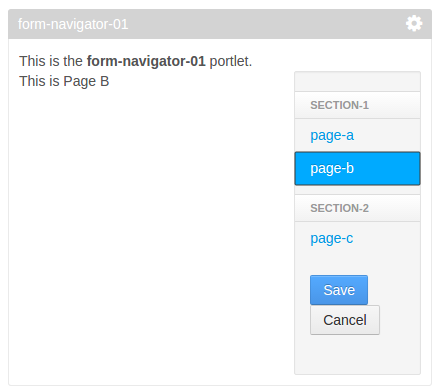
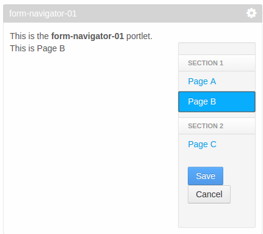

# liferay-ui:form-navigator portlet 2

Show how localization works with form-navigator tag

Language keys: file names with "-" instead of "_"
sections.jspf in form-navigator taglib will change "-" to "_" with _getSectionJsp(). It uses TextFormatter.N, see TextFormatter class.

Language keys in sections and categories are outputted with liferay-ui:message, so it will be transformed to the appropriate language

## Before localization

## After localization

